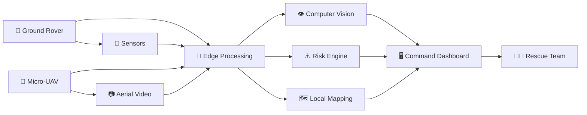
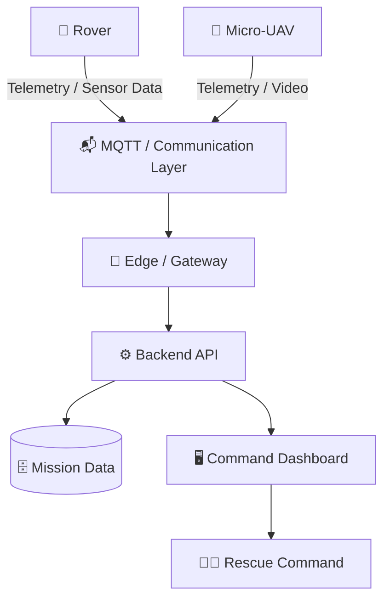

<div align="center">

# R.E.A.C.T.
### Robotic Emergency Assessment & Critical-response Technology

**AI-powered underground mine safety, monitoring and rescue system**

> **“Assess first. Enter safely. Rescue faster.”**

</div>

---

## 🚨 Problem Statement

**AI-Powered Underground Mine Safety, Monitoring and Rescue System**

Underground mines, tunnels and similar confined environments can become rapidly hazardous during fires, collapses, gas leaks and other emergencies. Sending human responders into an unknown environment before understanding the situation exposes rescuers to unnecessary risk.

R.E.A.C.T. is designed around a simple principle:

> **Send machines into danger first, build situational awareness, then help rescuers make better decisions.**

The proposed system combines a **ground rover**, a deployable **micro-UAV**, onboard sensing, computer vision, risk assessment and a live command dashboard.

---

## 🤖 What is R.E.A.C.T.?

R.E.A.C.T. is a **semi-autonomous robotic reconnaissance and rescue-assistance platform** for hazardous environments.

The system is designed to:

- 🔎 Detect and count trapped persons using computer vision
- 🧪 Monitor environmental hazards using onboard sensors
- ❤️ Capture preliminary close-range victim vital information
- 🗺️ Build a live operational/situation map
- ⚠️ Calculate and communicate risk levels
- 🚁 Deploy a micro-drone when the rover cannot safely reach an area
- 📡 Stream sensor and video information to a remote command center
- 👨‍🚒 Help rescue teams prioritize victims and safer routes

### Target environments

| Environment | Example hazards |
|---|---|
| ⛏️ Mining | Collapse, toxic gases, darkness |
| 🚇 Tunnels / Metro | Smoke, structural damage, blocked routes |
| 🏭 Industrial | Fire, chemical exposure, machinery hazards |
| 🚰 Sewers | Toxic gases, flooding, confined spaces |
| 🏚️ Structural collapse | Debris, unstable structures, trapped victims |
| 🌊 Flooded areas | Water ingress, inaccessible routes |

The architecture is intentionally **multi-environment** rather than being limited to mining alone.

---

## 🧠 System Overview



### End-to-end flow

1. 🚙 **Rover enters** the hazardous area.
2. 📷 Cameras and sensors continuously collect information.
3. 👁️ **Computer vision** identifies and counts potential victims.
4. 🧪 Environmental sensors identify hazards such as dangerous gases or abnormal thermal conditions.
5. 🧠 Edge processing reduces dependence on continuous external connectivity.
6. ⚠️ The **risk engine** fuses victim, hazard and environmental information.
7. 🗺️ A live operational map is constructed from available spatial data.
8. 🚁 If the rover is blocked or unable to reach an area, the **micro-UAV can be deployed**.
9. 📡 Data is transmitted to the command center.
10. 👨‍🚒 Rescue commanders use the dashboard to prioritize victims and plan safer intervention.

---

## ⭐ Core Innovation

### 1. Dual ground + air reconnaissance

Instead of relying on a single robotic platform, R.E.A.C.T. combines:

- 🚙 **Ground rover** — persistent ground-level sensing and navigation
- 🚁 **Micro-UAV** — access to areas that are blocked or difficult for the rover to reach

This gives the system a broader operational envelope than a single-platform rescue robot.

### 2. Unified victim + hazard assessment

The system is designed to combine:

**Victim detection + hazard detection + environmental data + risk scoring**

rather than treating each data source as an isolated subsystem.

### 3. Risk-based prioritization

Victims and locations can be assigned a simple operational risk state:

| Level | Meaning |
|---|---|
| 🟢 **Stable** | No immediate critical indication |
| 🟡 **Needs Attention** | Conditions require monitoring/intervention |
| 🔴 **Critical** | High-priority situation requiring urgent response |

> The risk engine is intended to **support rescue decision-making**, not replace trained rescue personnel.

---

## 🛠️ Technical Architecture

### Ground Unit

Potential hardware/software components:

- Camera
- Environmental sensors
- Gas sensors
- Thermal sensing
- LiDAR / depth sensing
- Embedded processing unit
- Rover chassis and drive system
- Communication module

### Air Unit

Potential components:

- Micro-UAV
- Camera
- GPS where available
- Video telemetry
- Flight controller
- Wireless communication

### Edge AI

Computer vision can be used for:

- Person detection
- Person counting
- Tracking
- Scene analysis
- Potential hazard recognition

The proposal identifies **YOLO / OpenCV** as the primary computer-vision stack.

### Risk Engine

The risk engine fuses:

```text
Victim observations
        +
Environmental hazards
        +
Sensor readings
        +
Location / map information
        ↓
   Risk assessment
        ↓
Stable / Attention / Critical
```

### Command Center

The dashboard is intended to provide:

- 📹 Live video
- 📊 Sensor telemetry
- 🚨 Alerts
- 👥 Victim locations/counts
- 🗺️ Situation map
- ⚠️ Risk levels
- 🟢 Potentially safer zones
- 🚙 Rover/UAV operational status

---

## 🧰 Technology Stack

| Layer | Technologies |
|---|---|
| 👁️ Computer Vision | [YOLO](https://docs.ultralytics.com/), [OpenCV](https://opencv.org/) |
| 🧠 AI / ML | [PyTorch](https://pytorch.org/) |
| 🔌 Embedded | [ESP32](https://www.espressif.com/en/products/socs/esp32), Arduino |
| 🚁 UAV Flight Control | [ArduPilot](https://ardupilot.org/), PX4 |
| 📡 Vehicle Telemetry | [MAVLink](https://mavlink.io/) |
| 📬 IoT Messaging | [MQTT](https://mqtt.org/) |
| 🗺️ Mapping | [Leaflet](https://leafletjs.com/) |
| 🌐 3D Visualization | [Three.js](https://threejs.org/) |
| ☁️ 3D Data | [Open3D](https://www.open3d.org/) |
| 🔧 Backend API | [Flask](https://flask.palletsprojects.com/) / [FastAPI](https://fastapi.tiangolo.com/) |

> **Implementation note:** The exact hardware models, communication hardware and final framework choices may change during prototyping. This README describes the proposed architecture rather than claiming that every listed component is already implemented.

---

## 📡 Communication Architecture



For underground environments, communication loss is a major design constraint. The proposal therefore considers **relay/mesh nodes** for extending communication coverage.

---

## 🗺️ Mission Situation Map

The command dashboard can represent:

- 📍 Rover position
- 📍 UAV position
- 👤 Detected victims
- ⚠️ Hazard locations
- 🟢 Safer zones
- 🔴 Critical zones
- 🧭 Explored/unexplored areas
- 🛣️ Potential navigation routes

A map-based interface makes raw sensor data more useful to human operators because it converts individual observations into an operational picture.

---

## 🔬 Sensor Fusion

A major design goal is to avoid making important decisions from a single sensor.

For example:

```text
Camera
  │
  ├──► Person detected
  │
Thermal Sensor
  │
  ├──► Heat signature detected
  │
Gas Sensor
  │
  ├──► Hazard concentration elevated
  │
LiDAR / Depth
  │
  └──► Environment / obstacle information
             │
             ▼
       Sensor Fusion
             │
             ▼
        Risk Engine
             │
             ▼
       Operator Alert
```

Sensor fusion can also help reduce false positives, although real-world validation will be required before operational deployment.

---

## 🧪 Feasibility

The proposed system uses established technologies:

- Rovers
- UAVs
- Cameras
- Environmental sensors
- Computer vision
- Embedded computing
- Wireless telemetry
- Web dashboards

The system is intentionally **semi-autonomous**, rather than fully autonomous. This keeps the prototype more realistic for a hackathon while retaining meaningful autonomy.

### Modular development strategy

The project can be developed in layers:

```text
Phase 1
├── Rover movement
├── Camera streaming
└── Basic telemetry

Phase 2
├── Person detection
├── Hazard sensing
└── Dashboard

Phase 3
├── Risk engine
├── Mapping
└── Alert prioritization

Phase 4
├── Micro-UAV integration
├── Relay / mesh communication
└── Advanced sensor fusion
```

---

## ⚠️ Challenges & Mitigation

| Challenge | Proposed mitigation |
|---|---|
| 🌫️ Poor visibility | Multi-modal sensing and robust vision models |
| 👤 Person detection errors | Model validation + sensor fusion |
| ❤️ Long-range vital-sign measurement | Restrict vitals assessment to close/contact range and label it as **preliminary assessment** |
| 📡 Underground connectivity loss | Relay / mesh communication nodes |
| 🪨 Uneven debris | Rugged modular rover chassis |
| 🔋 Battery endurance | Power budgeting and modular payloads |
| 🧪 Sensor false alarms | Calibration + multi-sensor fusion |
| 🚁 UAV accessibility | Deploy UAV specifically where the rover cannot reach |

---

## ❤️ Victim Vital Assessment

R.E.A.C.T. may incorporate close-range sensing for preliminary victim assessment.

**Important limitation:**

> The system is **not intended to provide medical diagnosis**.

Long-range vital-sign measurement can be unreliable in real-world rescue conditions. Therefore, vital sensing should be treated as a **preliminary assessment capability** and validated carefully before any operational use.

---

## 🛡️ Safety Philosophy

R.E.A.C.T. follows a simple hierarchy:

```text
1. Protect human responders
          ↓
2. Assess the environment
          ↓
3. Locate and prioritize victims
          ↓
4. Provide actionable information
          ↓
5. Support rescue operations
```

The robot is a reconnaissance and decision-support system, not a replacement for trained emergency personnel.

---

## 📊 Expected Impact

### Social

- ❤️ Faster identification of trapped victims
- 🧑‍🚒 Reduced exposure of rescue personnel to unknown hazards
- 🚨 Better prioritization during emergencies

### Economic

- Reduced manpower risk during initial search
- Reusable architecture across multiple disaster environments
- Potentially lower cost than deploying large numbers of personnel for initial reconnaissance

### Operational / Environmental

- 🌍 Multi-environment deployment potential
- 🗺️ Real-time operational picture
- ⚠️ Better awareness of hazards and accessible zones
- 🔧 Modular field-repair approach

---

## 🚀 Getting Started

> The exact installation commands depend on the final implementation. The following is the intended software layout.

### Prerequisites

- Python 3.x
- Git
- Node.js / npm
- Compatible embedded development environment
- Camera / sensor hardware for hardware-in-the-loop testing

### Clone the repository

```bash
git clone https://github.com/<YOUR-USERNAME>/<YOUR-REPOSITORY>.git
cd <YOUR-REPOSITORY>
```

### Backend

```bash
cd backend

python -m venv .venv
```

Windows:

```bash
.venv\Scripts\activate
```

Linux/macOS:

```bash
source .venv/bin/activate
```

Install dependencies once `requirements.txt` is finalized:

```bash
pip install -r requirements.txt
```

### Dashboard

```bash
cd dashboard
npm install
npm run dev
```

### AI / Computer Vision

For an Ultralytics-based prototype:

```bash
pip install ultralytics opencv-python
```

Then integrate the selected trained model into the inference pipeline.

---

## 🧪 Testing Strategy

Testing should progress from simulation to controlled physical environments before any real rescue application.

### Software tests

- Unit tests for sensor processing
- API tests
- Risk-engine tests
- Computer-vision benchmark tests
- Communication failure tests

### Hardware tests

- Rover obstacle testing
- Sensor calibration
- Camera performance under reduced visibility
- Battery/endurance testing
- Communication-range testing
- UAV deployment testing

### System tests

- Simulated victim detection
- Simulated hazard events
- Connectivity-loss scenarios
- Rover blockage → UAV deployment
- Multiple-victim prioritization

---

## 📚 Research & References

The original proposal identifies the following technical and research references:

- [Real-Time Human Detection in Search and Rescue Missions Using YOLOv8](https://www.ijraset.com/research-paper/real-time-human-detection-in-search-and-rescue-missions-using-yolov8)
- [Research article — PMC](https://pmc.ncbi.nlm.nih.gov/articles/PMC8588524/)
- [LAPSE research document](https://psecommunity.org/wp-content/plugins/wpor/includes/file/2304/LAPSE-2023.33160-1v1.pdf)
- [Kaggle discussion / reference](https://www.kaggle.com/discussions/getting-started/300882)

### Official technology documentation

- [Ultralytics YOLO](https://docs.ultralytics.com/)
- [OpenCV](https://opencv.org/)
- [PyTorch](https://pytorch.org/)
- [Espressif ESP32](https://www.espressif.com/en/products/socs/esp32)
- [ArduPilot](https://ardupilot.org/)
- [MAVLink](https://mavlink.io/)
- [MQTT](https://mqtt.org/)
- [Leaflet](https://leafletjs.com/)
- [Three.js](https://threejs.org/)
- [Open3D](https://www.open3d.org/)
- [Flask](https://flask.palletsprojects.com/)
- [FastAPI](https://fastapi.tiangolo.com/)

---

## 🧭 Roadmap

- [ ] Rover prototype
- [ ] Basic sensor integration
- [ ] Live camera streaming
- [ ] Person detection
- [ ] Hazard detection
- [ ] Sensor fusion
- [ ] Risk engine
- [ ] Live dashboard
- [ ] Local mapping
- [ ] MQTT telemetry
- [ ] Micro-UAV integration
- [ ] UAV deployment mechanism
- [ ] Relay / mesh communication
- [ ] Hardware-in-the-loop testing
- [ ] Controlled disaster-environment testing

---

## 📄 License

This project is currently under development.

Add the project's final open-source license here once the team has agreed on the licensing model.

---

<div align="center">

### R.E.A.C.T.

**Machines go first. Humans make the decisions.**

</div>
